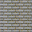

# Landscape Generator

A simple command-line landscape generator for use with OpenTTD.

Usage:

```sh
python3 landgen.py [-h] -i <INPUT_PATH> -o <OUTPUT_DIR> [-s <STRENGTH>] [-d] [-n] [-r <RESOLUTION>]
```
The input should be a simple square image, like this one:



- `-i INPUT_PATH, --input-path`: Path to the input file
- `-o OUTPUT_DIR, --output-dir`: Directory to save the output
- `-s STRENGTH, --strength`: Strength value (suggested: 0.25)
- `-d, --diagonal`: Output diagonal textures
- `-n, --diagonal-on-slopes`: Output diagonal textures on slopes
- `-r RESOLUTION, --resolution RESOLUTION`: Resolution of the output image (WIP)

This program produces 4 or 8 sets of landscape sprite (76 or 152 sprites in total), with each set facing a different direction.
The output is in **32bpp 1x**, so make sure to either remap the colours or encode 32bpp flags into your GRF.

Licensed under the MIT license.
